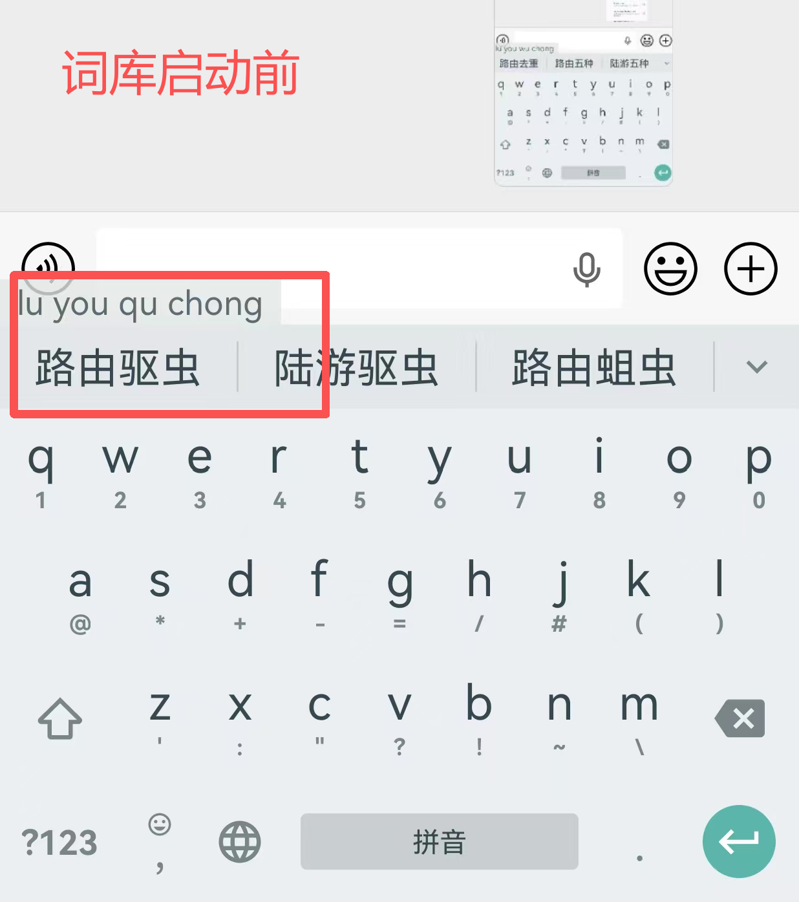
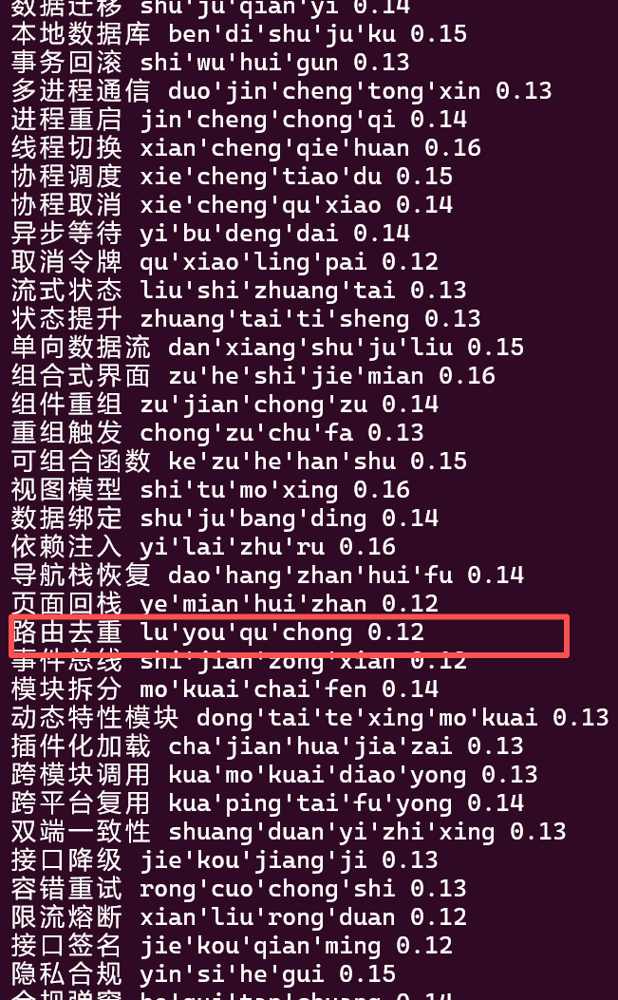
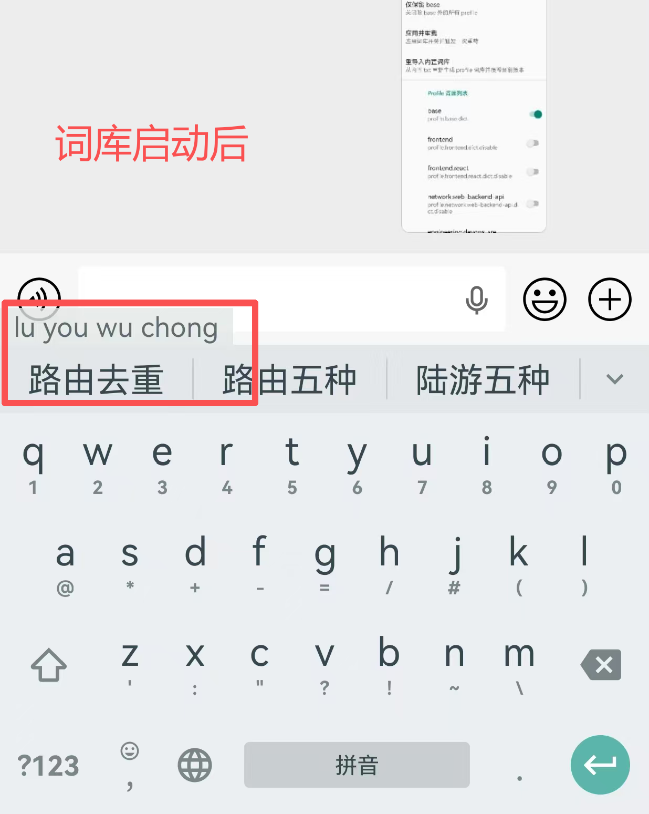
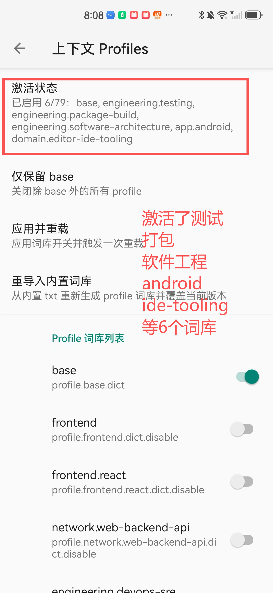

# jediterm-android

中文说明见 `README.zh_cn.md`.

An Android port of JetBrains' [JediTerm](https://github.com/JetBrains/jediterm) terminal emulation engine (UI built with Jetpack Compose). It's designed to connect to remote servers over SSH and run TUI apps like vim, htop, and tmux.

This repository produces an Android Library (`.aar`) intended to be consumed by the main project [kotlinagentapp](https://github.com/lemonhall/kotlinagentapp) via composite build or as a direct dependency. The main project already handles SSH via JSch; this library provides terminal emulation plus a Compose rendering/input layer.

## Demo

> Screenshot from the `:sample` demo app (verified on a physical device).


## Status (verified on device)

- Stable interactive SSH session over JSch (`ChannelShell`) with reliable input/echo; runs common TUI programs (vim/htop/tmux, etc.).
- Two critical issues have been fixed (disconnect-on-first-keystroke race, and macOS Chinese encoding), see "Gotchas & Fixes".

## Architecture

```
Android device                            Remote macOS
┌──────────────────────────┐        ┌──────────────────┐
│ ComposeTerminalView      │        │                  │
│   ↕ render / input       │        │  sshd → PTY      │
│ JediTerm core            │  SSH   │   ↕              │
│   ↕ terminal emulation   │◄──────►│  vim/htop/tmux   │
│ JSch (ChannelShell)      │        │                  │
└──────────────────────────┘        └──────────────────┘
```

## Modules

- `:lib` Android library (JediTerm core sources + Compose terminal components + TerminalDisplay adapter)
- `:sample` minimal demo app (build/render verification)

## Rendering approach

The UI renders terminal content character-by-character using a Compose `Canvas`, rather than `BasicText` / `AnnotatedString`, because:

- Terminals require precise monospace glyph positioning (especially for double-width CJK characters)
- Per-cell foreground/background control is needed (256 colors + true color)
- For fast scrolling in apps like vim, direct Canvas drawing performs better than rebuilding large annotated text spans

**Text selection** is implemented in-app (not using platform text selection), similar to Termux, iTerm2, and Windows Terminal:

- Long-press/drag → map touch coordinates to row/column → maintain selection state → draw highlight background → read text from `TerminalTextBuffer` → copy to clipboard
- Supports line selection and rectangular selection
- Double-tap to select a word; triple-tap to select a line
- Selection does not interfere with terminal mouse reporting (e.g. clicking in vim moves the cursor instead of selecting)
- JediTerm core includes `TerminalSelection`; the adapter layer builds on it

## Upstream

JediTerm sources are taken from JetBrains/jediterm: `985e58caa97899e2d1b933aecd326421c65cd729` (`core` module), licensed under Apache 2.0.

## Gotchas & Fixes

### 1) Race condition: early `onSizeChanged` triggers close the SSH channel

#### Root cause

After the SSH connection is established, `ComposeTerminalView.onSizeChanged` can fire immediately during the Compose layout phase, while `TerminalStarter`'s emulator loop is not fully ready yet. Calling `session.resize()` makes JediTerm write terminal resize control sequences into the SSH channel; at that moment, JSch's channel I/O pipeline may not be ready to accept such data, and the server may close the channel (typical log: `read returned -1 EOF`).

Symptom: the prompt appears after connecting (read path is OK), but the channel disconnects right after the first keystroke, and all subsequent input becomes ineffective.

#### Fix

Add a `sessionStarted` guard in `ComposeTerminalView`:

- In `LaunchedEffect`, after `startSession()` completes, wait 500ms before setting `sessionStarted = true`
- In `onSizeChanged`, only call `session.resize()` (and the upstream `onResize` callback) when `sessionStarted == true`

This avoids writing resize sequences while the emulator is not ready, eliminating the race.

### 2) Server-side locale/encoding: macOS SSH PTY with empty env causes Chinese mojibake

On macOS, sshd may create a new PTY session with `LANG` / `LC_CTYPE` unset. zsh can then treat high-bit bytes of UTF-8 multibyte sequences as meta characters, causing Chinese input/output to turn into sequences like `<0088><0091>`.

`JSchTtyConnector.connect()` fixes this by sending an initialization command:

- `export LANG=en_US.UTF-8; export LC_ALL=en_US.UTF-8; stty iutf8`

Side effect: the terminal echoes this initialization command after connecting. A future improvement is to issue `clear` to keep the screen clean.

## IME Bridge: Automatic Dictionary Profile Switching

The `:sample` app includes an **IME Bridge** feature that automatically detects directory changes in SSH sessions and sends dictionary profile configurations to the fcitx5 input method app.

### How it works

1. **Before activation**: When typing `luyouquchong` (路由驱虫), the input method suggests incorrect words:

   

2. **Automatic detection**: When you `cd` into a project directory containing `.ime/meta.json`, the SSH app automatically detects the configuration file and sends it to the fcitx5 IME app via broadcast.

3. **Dictionary activation**: The fcitx5 IME app receives the broadcast and activates the corresponding dictionary profiles:

   

4. **After activation**: Now typing `luyouquchong` shows the correct suggestion "路由去重" (route deduplication):

   

5. **Dictionary files**: The activated dictionary profiles contain domain-specific vocabulary:

   

### Integration

For downstream projects (like [kotlinagentapp](https://github.com/lemonhall/kotlinagentapp)) that want to integrate this feature, see the detailed integration guide: [docs/IME_BRIDGE_INTEGRATION.md](./docs/IME_BRIDGE_INTEGRATION.md)

## Build

```powershell
.\gradlew.bat :lib:assembleDebug
.\gradlew.bat :lib:testDebugUnitTest
.\gradlew.bat :sample:assembleDebug
.\gradlew.bat :sample:installDebug
```

## License

The Android adapter layer in this project is licensed under Apache 2.0. JediTerm core code follows its original Apache 2.0 license.
