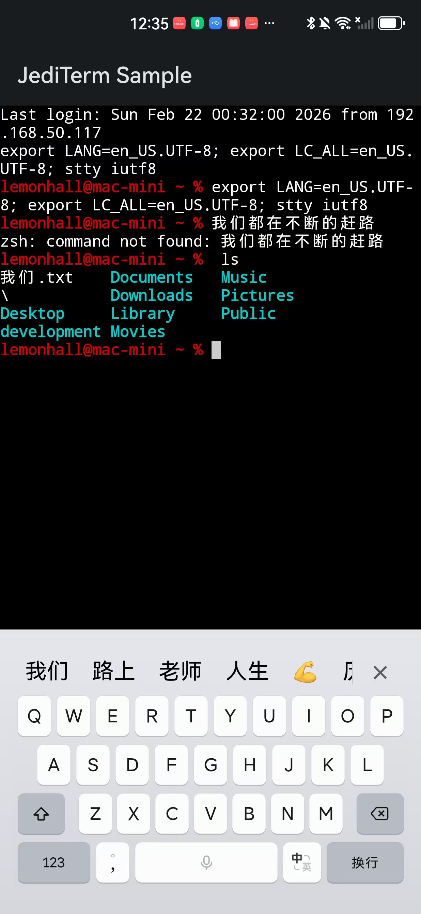

# jediterm-android

把 JetBrains 的 [JediTerm](https://github.com/JetBrains/jediterm) 终端仿真引擎移植到 Android（UI 使用 Jetpack Compose），用于通过 SSH 连接远程服务器并运行 TUI 程序（vim、htop、tmux 等）。

本仓库产出一个 Android Library（`.aar`），供主项目 [kotlinagentapp](https://github.com/lemonhall/kotlinagentapp) 通过 composite build 或直接依赖使用。主项目已使用 JSch 进行 SSH 连接，本库提供终端仿真和 Compose 渲染层。

## 运行效果

> 下面截图来自 `:sample` demo app（真机已验证可用）。



## 当前状态（已在真机验证）

- Android 端通过 JSch（`ChannelShell`）建立 SSH 连接后，可稳定输入/回显，运行常见 TUI 程序（vim/htop/tmux 等）。
- 已修复两个曾导致“能看到 prompt 但一打字就断开 / 中文乱码”的致命问题，见「踩坑与修复」。

## 架构

```
Android 设备                              远程 Mac
┌──────────────────────────┐        ┌──────────────────┐
│ ComposeTerminalView      │        │                  │
│   ↕ 渲染/输入            │        │  sshd → PTY      │
│ JediTerm core            │  SSH   │   ↕              │
│   ↕ 终端仿真             │◄──────►│  vim/htop/tmux   │
│ JSch (ChannelShell)      │        │                  │
└──────────────────────────┘        └──────────────────┘
```

## Modules

- `:lib` Android Library（JediTerm core 源码 + Compose 终端组件 + TerminalDisplay 适配）
- `:sample` 最小 demo app（编译/渲染验证用）

## 渲染方案

UI 层使用 Compose `Canvas` 逐字符绘制终端内容，而非 `BasicText` / `AnnotatedString`。原因：

- 终端需要精确的等宽字符定位（尤其是 CJK 双宽字符）
- 需要逐字符控制前景色/背景色（256 色 + true color）
- vim 等 TUI 程序快速滚动时，Canvas 直绘性能优于频繁重建 AnnotatedString

**文本选择**采用自实现方案（不依赖系统原生文本选择），与 Termux、iTerm2、Windows Terminal 等主流终端一致：

- 长按/拖拽手势 → 计算触摸坐标对应的行列位置 → 维护选区状态 → 绘制高亮背景 → 从 `TerminalTextBuffer` 读取选中文本 → 写入剪贴板
- 支持行选择和矩形选择
- 双击选词、三击选行
- 选择操作不干扰终端的鼠标事件上报（vim 中鼠标点击用于定位光标，不触发文本选择）
- JediTerm core 已内置 `TerminalSelection` 类，适配层基于此实现

## Upstream

JediTerm 源码取自 JetBrains/jediterm：`985e58caa97899e2d1b933aecd326421c65cd729`（`core` 模块），许可证选择 Apache 2.0。

## 踩坑与修复

### 1) 竞态问题：`onSizeChanged` 过早触发导致 SSH channel 被关闭

#### 问题根因

SSH 连接建立后，`ComposeTerminalView` 的 `onSizeChanged` 在 Compose 布局阶段会立即触发；但此时 `TerminalStarter` 的 emulator 循环尚未完全就绪。`session.resize()` 会让 jediterm 内部向 SSH channel 写入终端 resize 相关的控制序列，而此刻 JSch 的 channel IO 管道还没准备好接收这类数据，服务端可能直接关闭 SSH channel（典型日志：`read returned -1 EOF`）。

表现为：连接后能正常显示 prompt（read 正常），但第一次键盘输入后 channel 立即断开，后续所有输入无效。

#### 修复方式

在 `ComposeTerminalView` 中增加 `sessionStarted` 守卫：

- `LaunchedEffect` 里 `startSession()` 完成后，延迟 500ms 再将 `sessionStarted` 置为 `true`
- `onSizeChanged` 回调中仅当 `sessionStarted == true` 时才执行 `session.resize()`（以及上层 `onResize` 回调）

从而避免 emulator 未就绪时触发 resize 写入造成竞态。

### 2) 服务端语言编码问题：macOS SSH 新 PTY 环境变量为空导致中文乱码

macOS 的 sshd 给新 PTY session 分配的 `LANG` / `LC_CTYPE` 可能为空，zsh 会将 UTF-8 多字节序列的高位字节当作 meta 字符，导致中文输入/显示为 `<0088><0091>` 等乱码。

`JSchTtyConnector.connect()` 已通过发送初始化命令修复：

- `export LANG=en_US.UTF-8; export LC_ALL=en_US.UTF-8; stty iutf8`

副作用：连接后终端会回显这行初始化命令；可在后续版本中用 `clear` 清屏优化体验。

## Build

```powershell
.\gradlew.bat :lib:assembleDebug
.\gradlew.bat :lib:testDebugUnitTest
.\gradlew.bat :sample:assembleDebug
.\gradlew.bat :sample:installDebug
```

## License

本项目 Android 适配层代码采用 Apache 2.0 许可。JediTerm core 代码遵循其原始的 Apache 2.0 许可。
